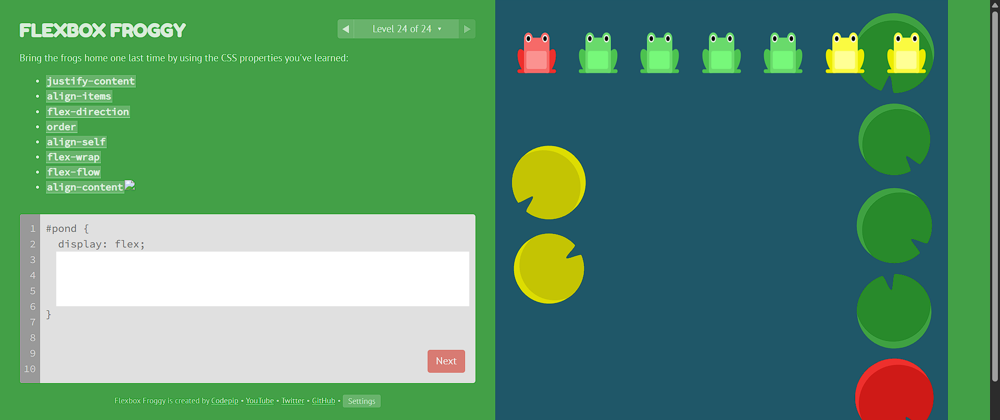

# Flexbox Practice & Progress 🚀

This week I focused on **mastering CSS Flexbox** through hands-on practice and interactive exercises.  
No more “tutorial hell” — I’m learning by doing and building muscle memory every day 💪

---

## 🧩 What I Learned

### 📦 Flexbox Core Concepts
- `justify-content` → control alignment along the **main axis**  
- `align-items` → control alignment along the **cross axis**  
- `flex-direction` → set the **direction** of the flex items  
- `flex-wrap` → wrap items onto multiple lines when needed  
- `align-self` → individually align one item differently  
- `align-content` → manage spacing **between** multiple lines of flex items  
-gap
---

### 💻 Practical Notes
```css
max-width: 600px;
width: 90%;
Using max-width and width together ensures a responsive layout —
the element adapts to different screen sizes but never stretches beyond the desired limit.

🎮 Practice & Resources

Flexbox Froggy
 — interactive game that helped me deeply understand
justify-content, align-items, and flex-direction.

Colt Steele’s Web Developer Bootcamp
 —
great exercises applying flexbox to real layouts (like box arrangements and alignment challenges).

🧠 Extra Learning

Learned how to add icons from Google Fonts by embedding the stylesheet and using
<span class="material-symbols-outlined"> tags.

Practiced building simple UI components (cards, buttons, and layouts) with real code instead of passive watching.

🏁 Reflection

Practicing flexbox every day built real muscle memory.
Instead of watching tutorials endlessly, I now learn by doing — building, testing, and breaking things on purpose.
(Not easy at all — but totally worth it. The satisfaction!)

📸 Screenshots

### 🎯 Flexbox Froggy


### 🧱 Colt Steele’s Flexbox Exercise


🎯 Flexbox Froggy Completed Levels

🧱 Colt Steele’s Flexbox Exercises

🔜 Next Steps

Dive deeper into CSS Grid and responsive design.

Recreate real website layouts using Flexbox + Grid combined.

Start documenting every mini-project to track progress and growth.

💚 Huge appreciation to MDN
 & Frontend Mentor

for their amazing resources and community support!